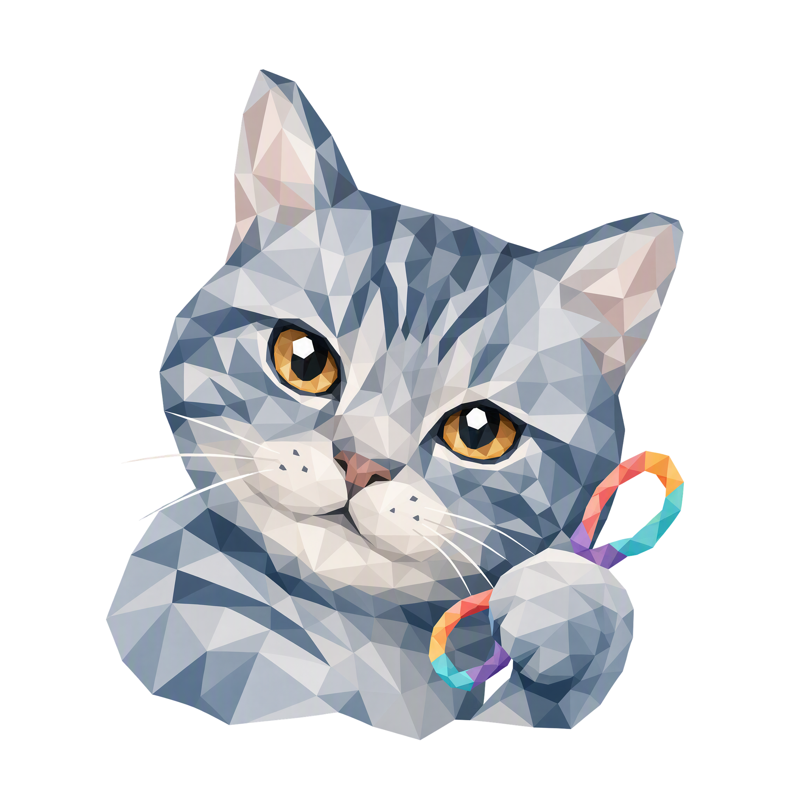

<p align="center"></p>

<h1 align="center">Meowth</h1>

<p align="center">
  <strong>本机 coding-agent 桥接层</strong><br>
  统一 SDK · HTTP 控制面 · 本机 dashboard · 远程可调度
</p>

<p align="center">
  <a href="https://github.com/nocoo/meowth/releases"></a>
  <a href="https://github.com/nocoo/meowth/actions/workflows/ci.yml"></a>
  
  
  
  <a href="LICENSE"></a>
</p>

---

Meowth 把本机已安装的 5 家 coding CLI（claude / codex / copilot / hermes / pi）包装成统一的 HTTP 服务,配套一个 go:embed 的 web dashboard 在本机管理一切。本机用、Tailscale 暴露给远端、Caddy 反代都行。

## 快速上手

```bash
pnpm install && pnpm daemon:build   # 1. 装依赖 + 编 meowthd 二进制
./daemon/meowthd init               # 2. 拿 root token（mwt_... 只显示一次,立即保存）
./daemon/meowthd serve              # 3. 起 daemon,默认 127.0.0.1:7040
open http://127.0.0.1:7040          # 4. 浏览器打开,粘 token,开始用
```

### Dashboard development (Vite)

The dashboard uses React + Vite. The Go binary embeds a production build;
frontend development uses Vite's Fast Refresh instead:

```bash
./daemon/meowthd serve   # Terminal 1, only if the daemon is not already running
pnpm dashboard:dev      # Terminal 2
```

Open **[meowth.dev.hexly.ai](https://meowth.dev.hexly.ai)** with the local
[Caddy routing](docs/features/08-dashboard-theme-and-vite.md#local-caddy-routing)
configured, or use **[127.0.0.1:37040](http://127.0.0.1:37040)** directly.
The HTTPS hostname keeps its existing browser login. Frontend edits update
automatically; the API continues to use the daemon on port 7040.

For another backend address, set `MEOWTH_DAEMON_URL` in the shell or in
`apps/dashboard/.env.local`. It configures Vite's server-side proxy.
First-run mint still requires the direct daemon URL
`http://127.0.0.1:7040/setup`; an existing token can be pasted into the dev UI.

Use `pnpm daemon:build` for an embedded production build. The direct daemon UI
shows that build after the rebuilt daemon is started. Frontend edits through
Vite do not require rebuilding or restarting the daemon.

### Windows（实验性 PowerShell 构建）

Windows 原生构建需要 Node.js 20+、pnpm 和 Go：

```powershell
pnpm install
.\scripts\build-daemon.ps1
.\daemon\meowthd.exe init
.\daemon\meowthd.exe serve
```

Meowth 本身不依赖任何特定 coding CLI。claude、codex、copilot、hermes
和 pi 都是可选 backend，只需安装实际要使用的 CLI。

Windows 支持目前仅覆盖原生构建以及核心 `init` / `serve` 流程，尚未作为
一等平台纳入完整 CI。POSIX `0600` / `0700` 文件权限在 Windows 上没有
等价的 ACL 保证，完整测试套件也仍包含 Unix-only 假设；请仅用于实验环境。

## 文档

| 入口 | 内容 |
|---|---|
| [`docs/01-project-overview.md`](docs/01-project-overview.md) | 项目定位 / 架构 / Phase 计划（先读这篇） |
| [`docs/architecture/`](docs/architecture/README.md) | 8 篇系统架构:SDK / HTTP / SQLite / mint / 远程 / dashboard / 安全 / 6DQ |
| [`docs/features/`](docs/features/README.md) | 功能迭代（如端口迁移到 Hexly Caddy） |
| [`docs/features/08-dashboard-theme-and-vite.md`](docs/features/08-dashboard-theme-and-vite.md) | Dashboard 主题统一与 Vite 热更新开发 |
| [`docs/features/09-chat-workspace-and-ui-polish.md`](docs/features/09-chat-workspace-and-ui-polish.md) | Chat 模板整合、富文本与全站 UI 规范 |
| [`CHANGELOG.md`](CHANGELOG.md) | 版本历史 |

## License

本仓库**根 license 是 [MIT](LICENSE)**,适用于所有原创代码（daemon `cmd/` + `internal/` + dashboard + scripts + docs）。

子目录 [`daemon/pkg/agent/`](daemon/pkg/agent/) 是从 [multica](https://github.com/multica-ai/multica) `server/pkg/agent/` vendored 的,按 Apache 2.0 §4 要求**保留上游 Modified Apache 2.0 license** —— 详见 [`daemon/pkg/agent/LICENSE`](daemon/pkg/agent/LICENSE) 与 [`daemon/pkg/agent/UPSTREAM.md`](daemon/pkg/agent/UPSTREAM.md)。multica 的两条额外限制（反 SaaS / 保留 logo）对本项目**不适用**:这是个人本机工具,且 dashboard 完全自写、未引入 multica 的 `apps/web/`。
